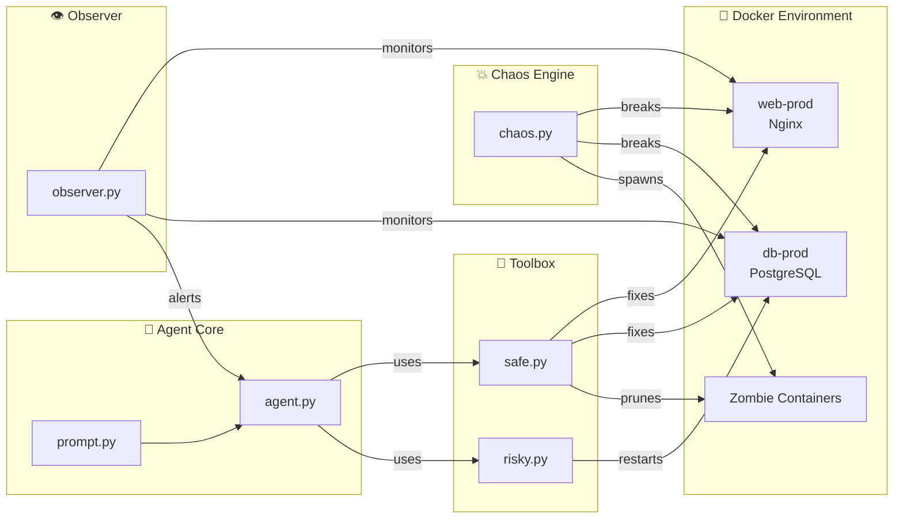

# 🛡️ OpsGuard — Architecture Overview

> **Autonomous Infrastructure Agent** — Self-healing ops powered by LLM decision-making.
> 
> *This document covers Phases 0–3. More phases incoming.*

---

## High-Level Vision

```mermaid
graph LR
    subgraph "💥 Chaos Engine"
        C[chaos.py]
    end

    subgraph "🐳 Docker Environment"
        W[web-prod<br/>Nginx]
        D[db-prod<br/>PostgreSQL]
        Z[Zombie Containers]
    end

    subgraph "👁️ Observer"
        O[observer.py]
    end

    subgraph "🧠 Agent Core"
        P[prompt.py] --> A[agent.py]
    end

    subgraph "🔧 Toolbox"
        S[safe.py]
        R[risky.py]
    end

    C -->|breaks| W
    C -->|breaks| D
    C -->|spawns| Z
    O -->|monitors| W
    O -->|monitors| D
    O -->|alerts| A
    A -->|uses| S
    A -->|uses| R
    S -->|fixes| W
    S -->|fixes| D
    R -->|restarts| D
    S -->|prunes| Z
```

