# 🛡️ OpsGuard — Architecture Overview

> **Autonomous Infrastructure Agent** — Self-healing ops powered by LLM decision-making.
> 
> *This document covers Phases 0–3. More phases incoming.*

---

## High-Level Vision

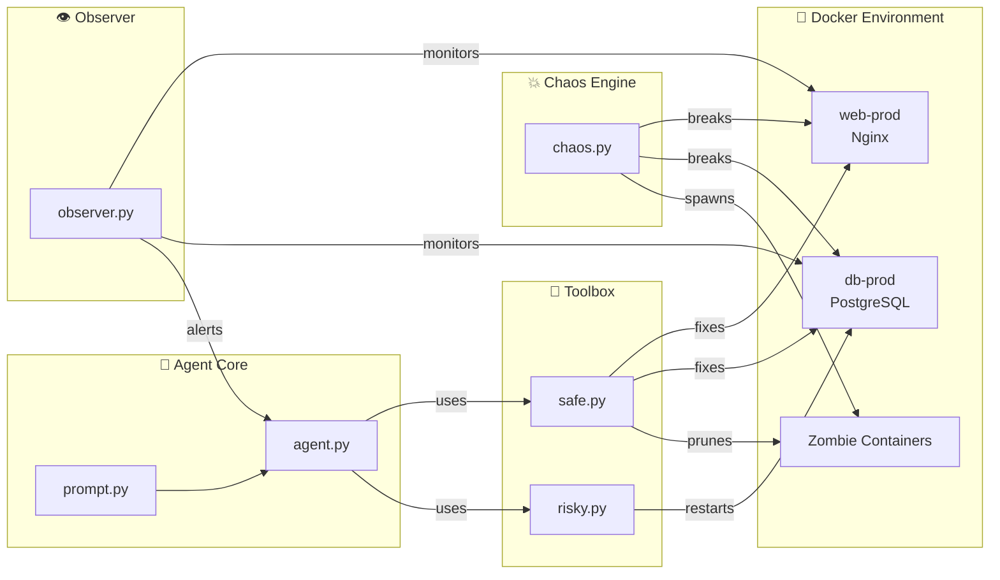

---

## Phase Roadmap

```mermaid
gantt
    title OpsGuard Implementation Phases
    dateFormat X
    axisFormat %s

    section Phase 0
    Project Bootstrap & Docker Setup    :done, p0, 0, 1

    section Phase 1
    Web Log Saturation & Zombies        :done, p1, 1, 2

    section Phase 2
    DB Resilience & Negative Scenarios   :active, p2, 2, 3

    section Phase 3
    Chain Reactions & Verification       :p3, 3, 4

    section Phase 4+
    Coming Soon...                       :milestone, p4, 4, 4
```

---

## Project Structure

```
opsguard/
├── docker-compose.yml        # Container orchestration
├── app.py                    # Entrypoint — wires Observer + Agent
├── chaos.py                  # 💥 Fault injection engine
├── test_chain.py             # Manual chain-failure test (Phase 3)
│
├── core/
│   ├── agent.py              # 🧠 LangChain ReAct agent
│   └── prompt.py             # 📜 System prompt & decision rules
│
├── tools/
│   ├── safe.py               # 🔧 Low-risk tools (clean_logs, prune)
│   └── risky.py              # ⚠️  High-risk tools (restart_database)
│
├── utils/
│   ├── observer.py           # 👁️ System monitor & alarm producer
│   └── security.py           # 🔐 Human-approval decorator
│
└── logs/
    ├── web/                  # Nginx log volume
    └── db/                   # PostgreSQL log volume
```

---

## Phase 0 — Bootstrap

Basic Docker environment + initial wiring.

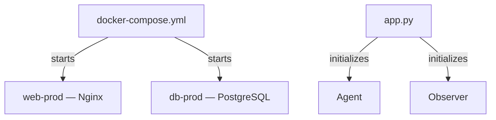

---

## Phase 1 — Dynamic Observation & Smart Cleanup

**Focus:** Web server log bloat (Saturation, not Crash) + Zombie containers.

### Chaos Scenarios (Phase 1)

| Scenario | Target | Method | Severity |
|---|---|---|---|
| `fill_web_disk_trigger()` | `web-prod` | `dd` → 2GB garbage log | 🟡 Saturation |
| `create_zombie_containers(15)` | Host | 15× `alpine` exited | 🟠 Pollution |

### Observer Alarm Matrix (Phase 1)

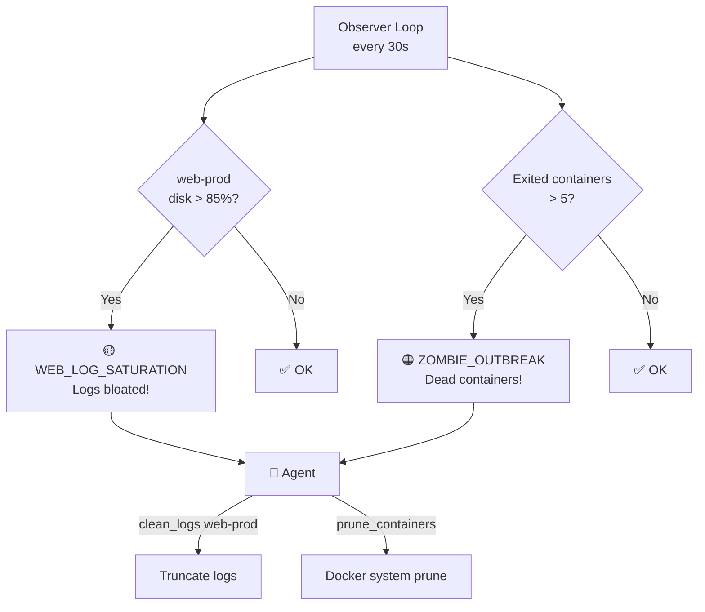

### Agent Decision Flow (Phase 1)

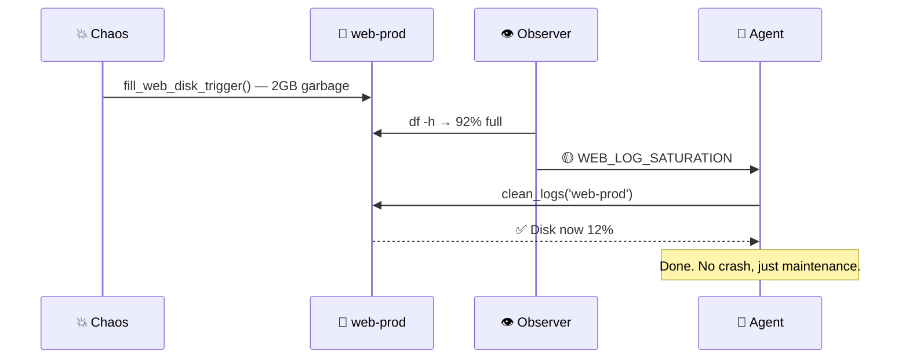

---

## Phase 2 — DB Resilience & Negative Scenarios

**Focus:** Teach the Agent to distinguish **fixable** vs **unfixable** database failures.

### Chaos Scenarios (Phase 2)

| # | Scenario | Target | Fixable? | Expected Agent Behavior |
|---|---|---|---|---|
| 1 | `trigger_db_garbage_flood()` | `db-prod` `/root/` | ❌ No | Clean → Fail → **STOP** |
| 2 | `trigger_config_corruption()` | `db-prod` conf | ❌ No | Report → **STOP** |
| 3 | `trigger_oom_kill()` | `db-prod` | ✅ Yes | `restart_database_risky` |
| 4 | `trigger_data_corruption()` | `db-prod` data | ❌ No | Report → **STOP** |

### Observer — Root Cause Tagging

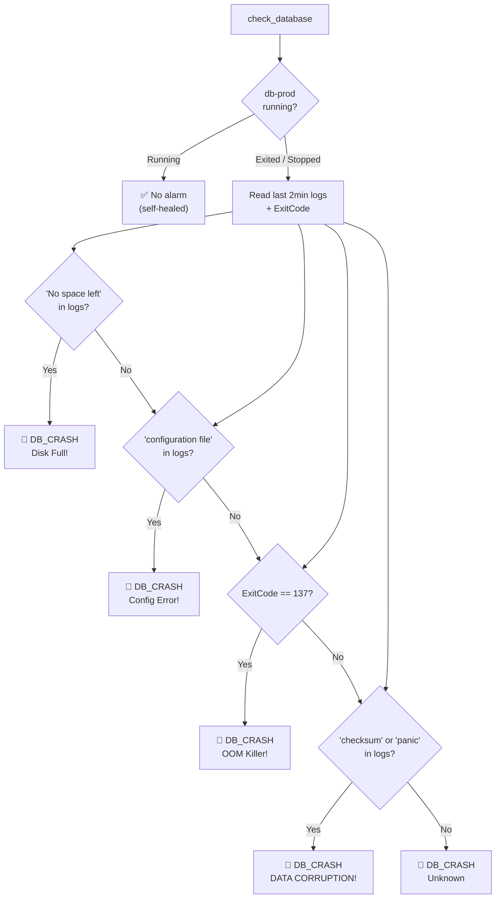

### Agent Decision Tree (Phase 2)

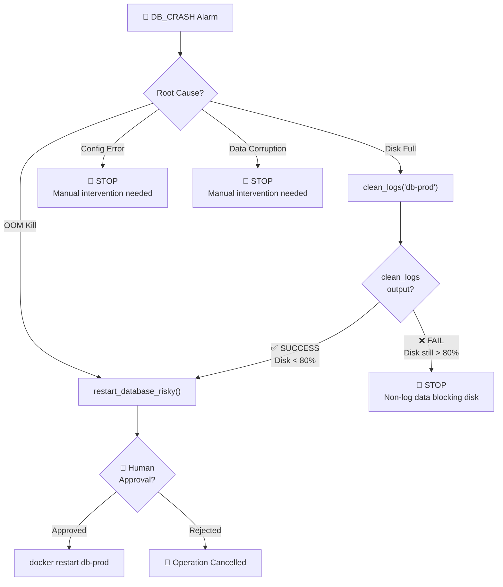

### Human Approval Gate

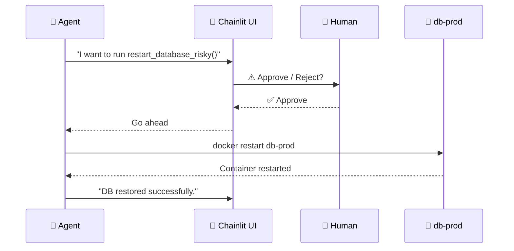

---

## Phase 3 — Chain Reactions & Autonomous Verification

**Focus:** Multi-step remediation. Agent doesn't stop after one fix — it **verifies** and continues.

### Chain Failure Scenario

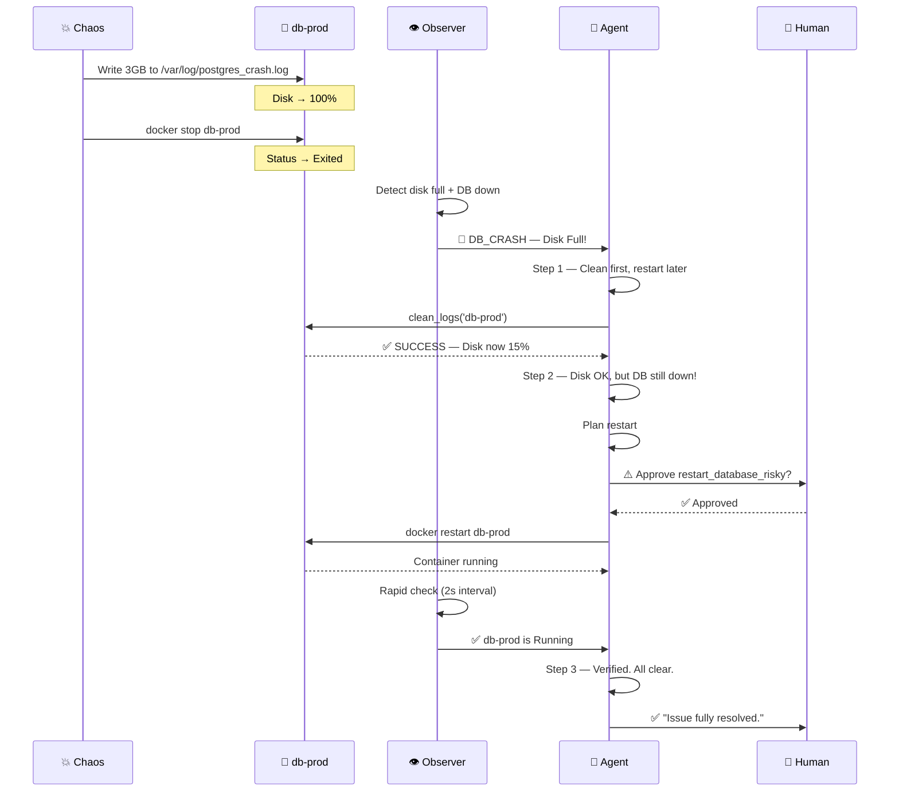

### Rapid Check Mechanism

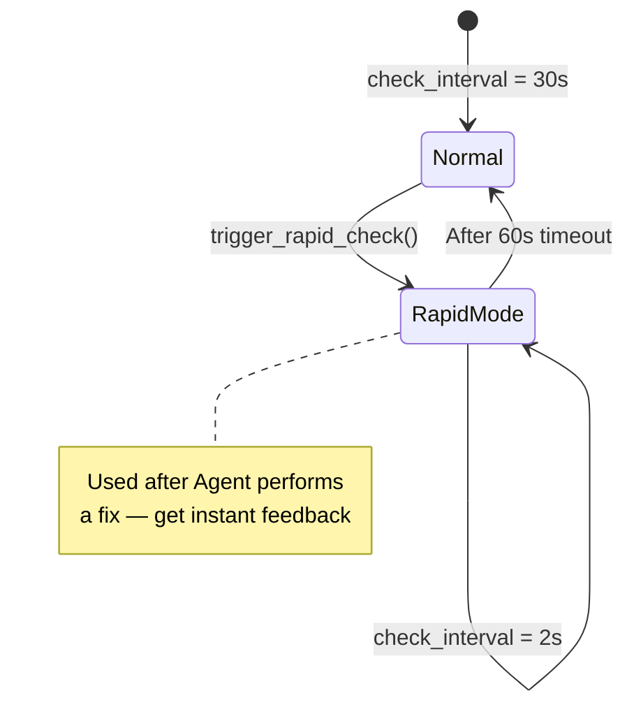

### Verification Protocol

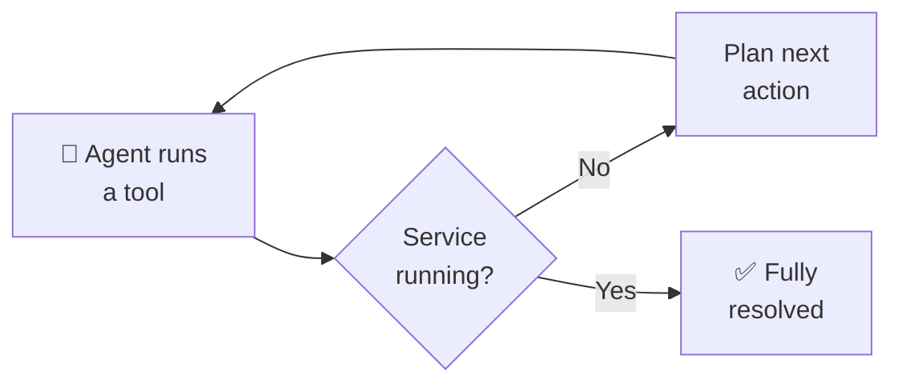

> **Key Rule:** Never send "Final Answer" until the root service is confirmed **Running**.

---

## Tool Inventory

| Tool | File | Risk | Approval | Phase |
|---|---|---|---|---|
| `clean_logs(container)` | `safe.py` | 🟢 Safe | No | 1 |
| `prune_containers(reason)` | `safe.py` | 🟢 Safe | No | 1 |
| `restart_database_risky(reason)` | `risky.py` | 🔴 Risky | ✅ Required | 2 |

---

## Alarm Catalog

| Alarm Code | Source | Severity | Auto-Fixable | Phase |
|---|---|---|---|---|
| `WEB_LOG_SATURATION` | Observer → disk | 🟡 Warning | ✅ `clean_logs` | 1 |
| `ZOMBIE_OUTBREAK` | Observer → docker | 🟠 Warning | ✅ `prune_containers` | 1 |
| `DB_CRASH — Disk Full` | Observer → logs | 🔴 Critical | ⚠️ Conditional | 2 |
| `DB_CRASH — OOM Killer` | Observer → exit code | 🔴 Critical | ✅ `restart_database` | 2 |
| `DB_CRASH — Config Error` | Observer → logs | 🔴 Critical | ❌ Manual only | 2 |
| `DB_CRASH — Data Corruption` | Observer → logs | 🔴 Critical | ❌ Manual only | 2 |

---

## Docker Topology

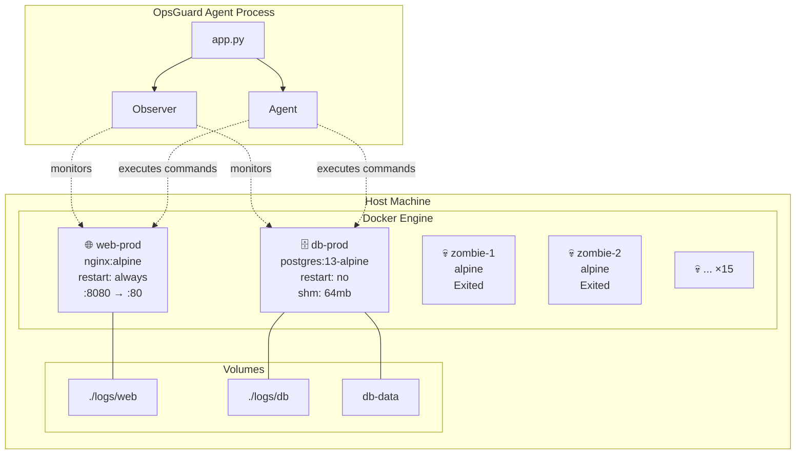

---

## What's Next? (Phase 4+)

```
🔮 Upcoming phases may include:
   • Multi-service dependency graphs
   • Predictive alerting (before failure)
   • Auto-scaling decisions
   • Incident post-mortem generation
   • ... and more chaos 💥
```

---

<sub>Generated for OpsGuard project — Architecture v0.3 (through Phase 3)</sub>
